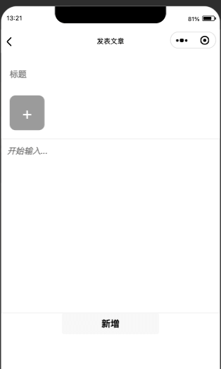

## 文章小程序全栈开发  

#### 技术框架   
|类型|技术|
| -- | --|
|后台|express|
|小程序|微信原生开发|
|数据库|Mysql和MongoDB|
|数据库连接|[access-db](https://github.com/zomem/access-db)|
|服务器|阿里云轻量服务器centos7|
|文件加速|阿里云cdn|
  
#### 展示  
  
  
  
#### 使用  

**数据库**
将`bidu.sql`导入到mysql数据库。并在`.env`里配置mysql用户和密码  
  
**服务器**  
  
```bash
cd server
npm install
npm run start
```
  
**小程序**  
  
用微信开发工具打开`mini`即可。
  


#### 教程地址列表  
  
[文章小程序全栈开发，从入门到上线，第1节——准备](https://segmentfault.com/a/1190000040775333)  
  
[文章小程序全栈开发，从入门到上线，第2节——新建小程序和后台](https://segmentfault.com/a/1190000040775343)  
  
[文章小程序全栈开发，从入门到上线，第3节——小程序登录](https://segmentfault.com/a/1190000040775346)  
  
[文章小程序全栈开发，从入门到上线，第4节——发布文章](https://segmentfault.com/a/1190000040775354)  
  
[文章小程序全栈开发，从入门到上线，第5节——获取文章列表和详情](https://segmentfault.com/a/1190000040775357)  
  
[文章小程序全栈开发，从入门到上线，第6节——服务器环境搭建](https://segmentfault.com/a/1190000040775373)  
  
[文章小程序全栈开发，从入门到上线，第7节——域名、服务器、证书、cdn的配置](https://segmentfault.com/a/1190000040775393)  
  
[文章小程序全栈开发，从入门到上线，第8节——部署上线](https://segmentfault.com/a/1190000040775407)  
  